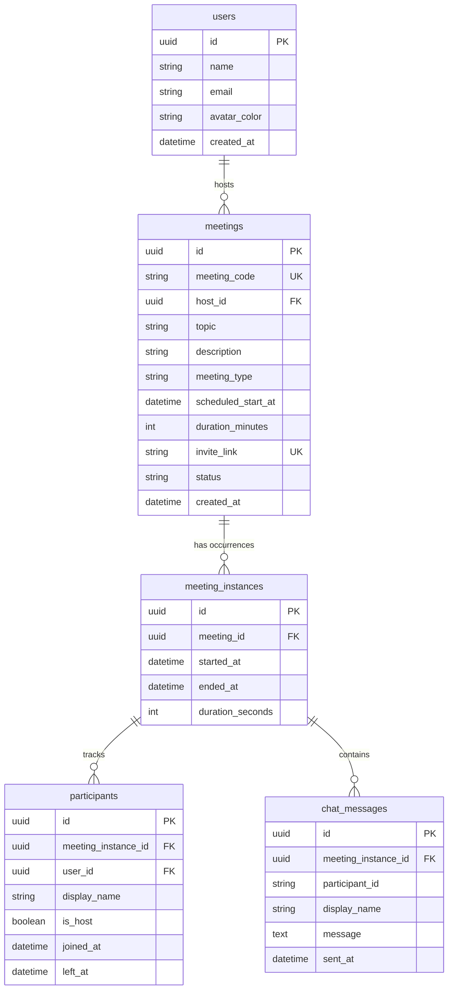

# MeetClone — Pixel-Accurate Zoom Web Client Clone

MeetClone is a full-stack, production-quality video conferencing web application that replicates the Zoom web client (`app.zoom.us` pre-meeting dashboard + in-meeting room UI). Built with **Django REST Framework + Django Channels (Daphne)** on the backend and **Next.js 14+ (App Router) + Tailwind CSS + Zustand** on the frontend.

---

## 🚀 Tech Stack Summary

### Frontend
- **Framework**: Next.js 14+ (App Router, TypeScript)
- **Styling**: Tailwind CSS v4 configured with custom Zoom design tokens (`#2D8CFF` blue, `#F9634A` orange, `#00A85F` green, `#E02D2D` red, `#0E0E0E` dark room)
- **Typography**: Google Fonts `Lato`
- **State Management**: Zustand (`meetingStore`, `mediaStore`)
- **Real-Time & Media**: Native WebRTC APIs (`RTCPeerConnection`, `getUserMedia`, `getDisplayMedia`) with mesh P2P topology, native WebSockets
- **Icons & Formatting**: `lucide-react`, `dayjs`

### Backend & Database
- **Framework**: Python 3.12, Django 5, Django REST Framework
- **Real-Time Signaling**: Django Channels 4 + Daphne ASGI server
- **Database**: SQLite with Django ORM migrations & custom seed management command
- **Data Validation**: DRF Serializers

---

## 📦 Setup & Running Instructions

### Prerequisites
- Python 3.10+
- Node.js 18+ & npm

### 1. Backend Setup (Django)
```bash
# Navigate to backend directory
cd backend

# Activate virtual environment
source venv/bin/activate   # Linux/macOS
# or: venv\Scripts\activate # Windows

# Run migrations
python manage.py migrate

# Seed database with default user & sample meetings
python manage.py seed

# Start Daphne ASGI server on port 8000
python manage.py runserver 8000
```
*The backend API will be live at `http://localhost:8000/api/meetings/` and WebSocket signaling at `ws://localhost:8000/ws/meeting/:instance_id/`.*

### 2. Frontend Setup (Next.js)
```bash
# Open a new terminal and navigate to frontend directory
cd frontend

# Install dependencies (if not already installed)
npm install

# Start Next.js development server
npm run dev
```
*Open `http://localhost:3000` in your web browser to access the dashboard.*

---

## 🗄️ Database Schema & Design Rationale

The database architecture uses 5 normalized tables to cleanly separate persistent meeting definitions from active occurrences and user participation:



### Why this 5-Table Schema Design?
1. **Meeting vs. Instance Separation**: A scheduled meeting (`meetings`) represents the reusable definition or room link. A `meeting_instance` represents a single live occurrence. This allows recurring or scheduled meetings to be started multiple times without overwriting history.
2. **Participant Lifecycle**: Tracking `joined_at` and `left_at` per `participant` enables accurate attendance reporting and auto-computes `duration_seconds` when all participants leave.
3. **Auth-Ready Structure**: While no login flow is required for this scope (a single seeded default user `Rajneesh Sharma` is used), every model references `user_id` / `host_id` foreign keys, ensuring production auth readiness.

---

## 💡 Assumptions Made

1. **Authentication**: Auth flow is omitted per spec. The application operates under a seeded default host (`Rajneesh Sharma`, `rajneesh@meetclone.dev`).
2. **WebRTC Topology**: Mesh P2P topology is implemented. Each client connects directly to every other participant, ideal for group sizes up to 6 participants.
3. **NAT Traversal**: Public Google STUN servers (`stun:stun.l.google.com:19302`) are used for candidate discovery. Symmetric NAT environments would require TURN server relay.

---

## ⚠️ Known Limitations & Future Enhancements

- **SFU/MCU Upgrade**: Mesh topology works cleanly for small rooms; implementing a Selective Forwarding Unit (SFU) like Mediasoup/Janus would enable 50+ participant calls.
- **TURN Server Support**: Adding Coturn for TURN relay in strict corporate firewalls.
- **JWT Auth**: Full OAuth2 / JWT authentication flow with registration, password reset, and user profiles.
- **Cloud Recording**: Server-side recording of video/audio streams via FFmpeg.
- **Breakout Rooms**: Sub-room grouping & host broadcasting.

---

## 📋 Checklist & Feature Audit

| Spec Feature | Status | Notes |
| :--- | :---: | :--- |
| **Dashboard Layout** | ✅ | Sidebar, TopNav, Greeting with live clock, 4 Action Buttons |
| **Instant Meeting** | ✅ | Click "New Meeting" → Pre-join Lobby → Live Room |
| **Schedule Meeting** | ✅ | Form with date/time, persistence to DB, upcoming list grouping |
| **Join Meeting** | ✅ | ID validation endpoint, inline error on invalid code, pre-join lobby |
| **Pre-join Lobby** | ✅ | Camera preview tile, mic/camera toggle, name input |
| **In-Meeting Room** | ✅ | Dark background (`#0E0E0E`), responsive video grid, mirrored self-view |
| **Control Bar** | ✅ | Auto-hiding control bar, Mute, Video, Participants badge, Chat, Screen Share (green), Leave |
| **Host Controls** | ✅ | Crown badge, "Mute All", per-participant "Mute" & "Remove" on hover |
| **In-Meeting Chat** | ✅ | Real-time message broadcast with timestamps |
| **Screen Sharing** | ✅ | `getDisplayMedia()` track replacement across peer connections |
| **Post-Meeting Screen** | ✅ | Summary screen on leave showing duration & meeting topic |
